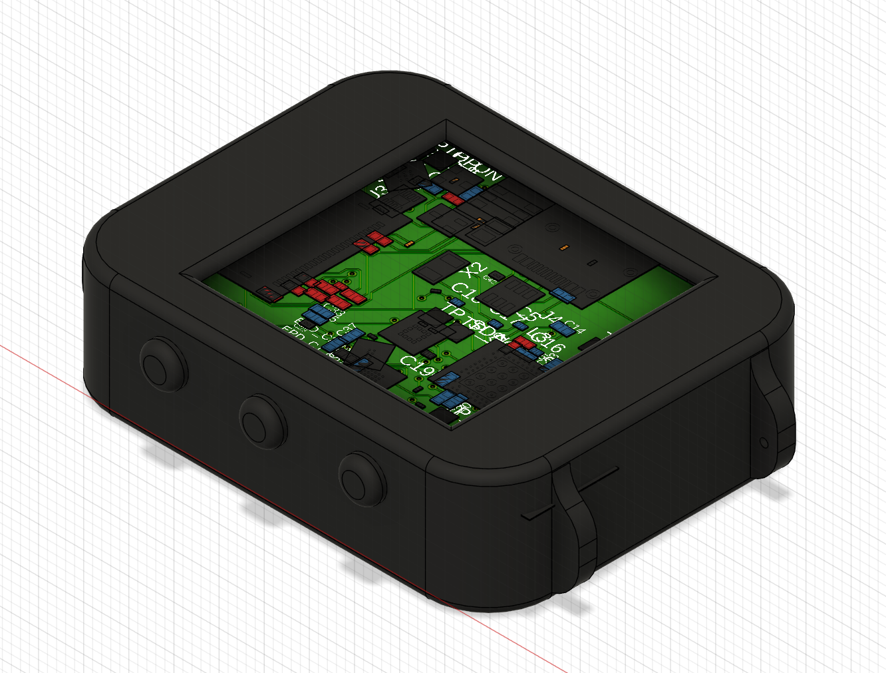

# InkTime
## Block Diagram


If GitHub does not render Mermaid, use this ASCII version instead:

# Block Diagram

### Summary

The nRF52840 is the main controller of the board.
Power comes from USB-C and the Li-Po battery through the BQ25180 charger and the RT6160A DC/DC regulator. The MCU talks over I2C with the BMA421 IMU, MAX17048 fuel gauge, and DRV2605 haptic driver. It also controls the E-Paper display through SPI and extra control lines, reads the buttons, and exposes SWD for programming and debug.

### Overview
```
USB-C -----> nRF52840 <-----> BMA421 IMU
  |             |               (I2C)
  |             |
  |             +-------------> Buttons
  |             |
  |             +-------------> SWD Header
  |             |
  |             +-------------> E-Paper Display
  |                    (SPI + control)
  |
  +-----> BQ25180 Charger -----> Li-Po Battery
                 |
                 +-----> RT6160A DC/DC -----> 3V3 
                                          |-> nRF52840
                                          |-> MAX17048 Fuel Gauge
                                          |-> DRV2605 Haptic Driver
                                          |-> E-Paper Drive Circuit
```


## Bill of Materials (BOM)

The table below lists the main parts used in the project.  
For standard passives (0201 / 0402 capacitors and resistors), the exact values and designators are already included in `BOM.csv`.  
JLC links below are **search links**, so you can quickly find the matching part on JLC Parts.

| Designators | Qty | Part / Function | Manufacturer | MPN | Package / Notes | JLC Parts | Datasheet |
|---|---:|---|---|---|---|---|---|
| U1 | 1 | Main MCU | Nordic Semiconductor | nRF52840 | AQFN-73 / 7x7 mm | [JLC Search](https://jlcpcb.com/parts/componentSearch?searchTxt=nRF52840) | [Datasheet](https://docs.nordicsemi.com/bundle/ps_nrf52840/page/keyfeatures_html5.html) |
| IC1 | 1 | Li-Po charger | Texas Instruments | BQ25180YBGR | DSBGA-8 | [JLC Search](https://jlcpcb.com/parts/componentSearch?searchTxt=BQ25180YBGR) | [Datasheet](https://www.ti.com/lit/gpn/BQ25180) |
| IC9 | 1 | Buck-boost regulator | Richtek | RT6160AWSC | WL-CSP-15 | [JLC Search](https://jlcpcb.com/parts/componentSearch?searchTxt=RT6160AWSC) | [Datasheet](https://www.mouser.com/datasheet/2/1458/DS6160A_02-3104604.pdf) |
| IC3 | 1 | IMU / accelerometer | Bosch Sensortec | BMA423 | LGA-12 | [JLC Search](https://jlcpcb.com/parts/componentSearch?searchTxt=BMA423) | [Datasheet](https://watchy.sqfmi.com/assets/files/BST-BMA423-DS000-1509600-950150f51058597a6234dd3eaafbb1f0.pdf) |
| U3 | 1 | Fuel gauge | Analog Devices / Maxim | MAX17048G+T10 | 9-bump UCSP | [JLC Search](https://jlcpcb.com/parts/componentSearch?searchTxt=MAX17048G%2BT10) | [Datasheet](https://www.analog.com/media/en/technical-documentation/data-sheets/max17048-max17049.pdf) |
| IC2 | 1 | Haptic driver | Texas Instruments | DRV2605YZFR | DSBGA-9 | [JLC Search](https://jlcpcb.com/parts/componentSearch?searchTxt=DRV2605YZFR) | [Datasheet](https://www.ti.com/lit/ds/symlink/drv2605.pdf) |
| ANT1 | 1 | 2.4 GHz chip antenna | Johanson Technology | 2450AT18B100E | Ceramic antenna | [JLC Search](https://jlcpcb.com/parts/componentSearch?searchTxt=2450AT18B100E) | [Datasheet](https://www.johansontechnology.com/docs/1187/2450AT18B100_X8XXogU.pdf) |
| J1 | 1 | E-paper FPC connector | Molex | 503480-2400 | 24-pin, 0.5 mm pitch | [JLC Search](https://jlcpcb.com/parts/componentSearch?searchTxt=503480-2400) | [Datasheet](https://www.molex.com/en-us/products/part-detail/5034802400) |
| J4 | 1 | USB-C connector | Kinghelm | KH-TYPE-C-16P | USB Type-C, SMT | [JLC Search](https://jlcpcb.com/parts/componentSearch?searchTxt=KH-TYPE-C-16P) | [Datasheet](https://datasheet.lcsc.com/lcsc/2404191039_Shenzhen-Kinghelm-Elec-KH-TYPE-C-16P_C709357.pdf) |
| J2 | 1 | SWD programming connector | Tag-Connect | TC2030-IDC | 6-pin cable / debug | [JLC Search](https://jlcpcb.com/parts/componentSearch?searchTxt=TC2030-IDC) | [Datasheet](https://www.tag-connect.com/wp-content/uploads/bsk-pdf-manager/2019/12/TC2030-IDC-Datasheet-Rev-B.pdf) |
| D3 | 1 | USB ESD protection | STMicroelectronics | USBLC6-2SC6Y | SOT-23-6 | [JLC Search](https://jlcpcb.com/parts/componentSearch?searchTxt=USBLC6-2SC6Y) | [Datasheet](https://www.st.com/resource/en/datasheet/usblc6-2sc6y.pdf) |
| D2, D4, D5 | 3 | Schottky diode | onsemi | MBR0530 | SOD-123 | [JLC Search](https://jlcpcb.com/parts/componentSearch?searchTxt=MBR0530) | [Datasheet](https://www.onsemi.com/pdf/datasheet/mbr0530t1-d.pdf) |
| Q3 | 1 | N-MOSFET | Vishay | SI1308EDL-T1-GE3 | SC-70 | [JLC Search](https://jlcpcb.com/parts/componentSearch?searchTxt=SI1308EDL-T1-GE3) | [Datasheet](https://www.vishay.com/docs/63399/si1308edl.pdf) |
| Q1 | 1 | P-MOSFET | Diodes Inc. / equivalent | DMG2305UX-7 | SOT-23 | [JLC Search](https://jlcpcb.com/parts/componentSearch?searchTxt=DMG2305UX-7) | [Datasheet](https://www.diodes.com/assets/Datasheets/DMG2305UX.pdf) |
| L7 | 1 | Power inductor | TDK | MLP2016SR47MT0S1 | 0.47 uH | [JLC Search](https://jlcpcb.com/parts/componentSearch?searchTxt=MLP2016SR47MT0S1) | [Datasheet](https://product.tdk.com/system/files/dam/doc/product/inductor/inductor/smd/catalog/inductor_commercial_multilayer_mlp2016_en.pdf) |
| L5 | 1 | Inductor | Generic / selected by value | 68uH | E-paper drive | [JLC Search](https://jlcpcb.com/parts/componentSearch?searchTxt=68uH) | - |
| L2 | 1 | Inductor | Generic / selected by value | 10uH | Power stage | [JLC Search](https://jlcpcb.com/parts/componentSearch?searchTxt=10uH) | - |
| L1 | 1 | RF inductor | Generic / selected by value | 3.9nH | RF matching | [JLC Search](https://jlcpcb.com/parts/componentSearch?searchTxt=3.9nH) | - |
| L3 | 1 | RF inductor | Generic / selected by value | 15nH | RF matching | [JLC Search](https://jlcpcb.com/parts/componentSearch?searchTxt=15nH) | - |
| X1 | 1 | High-frequency crystal | Generic / selected by value | 32MHz | 2016 package | [JLC Search](https://jlcpcb.com/parts/componentSearch?searchTxt=32MHz) | - |
| X2 | 1 | RTC crystal | Generic / selected by value | 32.768kHz | 3215 package | [JLC Search](https://jlcpcb.com/parts/componentSearch?searchTxt=32.768kHz) | - |
| SW_UP, SW_ENT, SW_DN | 3 | Push buttons | Panasonic | EVP-AKE31A | SMD tactile switch | [JLC Search](https://jlcpcb.com/parts/componentSearch?searchTxt=EVP-AKE31A) | [Datasheet](https://industrial.panasonic.com/cdbs/www-data/pdf/ABV0000/ABV0000C90.pdf) |
| TP_3.3V, TP_BAT_GND, TP_GND, TP_ON, TP_OP, TP_RESET, TP_SCL, TP_SDA, TP_SWDCLK, TP_SWDIO, TP_SWO, TP_VBAT | 12 | Test pads | Generic | TP20R | Debug / measurement | [JLC Search](https://jlcpcb.com/parts/componentSearch?searchTxt=test%20pad) | - |

### Standard passives

The board also uses standard SMD resistors and capacitors:

- **All resistors:** 0201
- **Capacitors <= 100 nF:** 0201
- **Capacitors > 100 nF:** 0402
- Exceptions are used only where the schematic explicitly asks for another case

Examples from this design:
- 12 pF, 1 pF, 100 nF, 47 nF, 820 pF, 100 pF capacitors
- 1 uF, 4.7 uF, 10 uF, 22 uF capacitors
- 0R, 2.2R, 470 mR, 3.3 kR, 5.1 kR, 10 kR resistors

For these passives, the exact reference designators, values, and package choices are already listed in `BOM.csv`.

## Hardware Overview

[SCHEMATIC](./Hardware/Schematic.pdf)

### MCU: nRF52840
Central processor managing all peripherals and communication interfaces (GPIO, I2C, SPI, USB).

### Power section
Li‑Po charger (BQ25180) and DC/DC regulator (RT6160A) handle battery charging and generate system voltage rails.

### IMU
BMA421 accelerometer on the I2C bus providing motion data and interrupt outputs.

### USB‑C and ESD protection
USB‑C port supplies power and data, with ESD components protecting the USB lines.

### E‑Paper display
SPI‑driven display connected via FPC, supported by dedicated driving circuitry for panel voltages.

### Fuel gauge
MAX17048 on I2C measuring battery voltage and state‑of‑charge.

### Buttons
Three user buttons (UP, ENTER, DOWN) connected to MCU GPIO pins.

### Haptic driver
DRV2605 (I2C) controlling a vibration motor for tactile feedback.

### SWD debug header
Provides SWDIO, SWDCLK, reset, power, and ground for programming and debugging.

### Block connections
Power flows from USB/battery through charger and regulators; I2C links IMU, fuel gauge, and haptics; SPI and control lines drive the display; GPIO handles buttons and interrupts.

## Central processor - nRF52840

### Short summary
The nRF52840 coordinates the entire system—power, sensors, display, buttons, and haptics—acting as the central controller for all board functions.

### Pins

the nRF52840 uses:
- **native USB pins** for USB,
- **one shared I2C bus** for low-speed peripheral chips,
- **SPI + control pins** for the e-paper display,
- **GPIO inputs** for buttons,
- **interrupt pins** for IMU, battery, and power events,
- and **SWD pins** for debug.


### Why these choices make sense

- **USB** is connected to the nRF52840 native USB pins, so firmware upload and USB communication are direct and simple.
- **I2C** is used for support chips like the charger, IMU, fuel gauge, and haptic driver because these parts only need low-speed control.
- **SPI** is used for the e-paper display because it is better for sending display data.
- **Interrupt lines** such as **ALERT**, **PMIC_INT**, **IMU_INT1**, and **IMU_INT2** help the MCU wake up only when needed, which is better for low power.
- **Buttons** are on simple GPIO pins because they only need digital input reads.
- **SWDIO**, **SWDCLK**, and **RESET** are broken out for easy programming and debugging during bring-up.

## End Result

